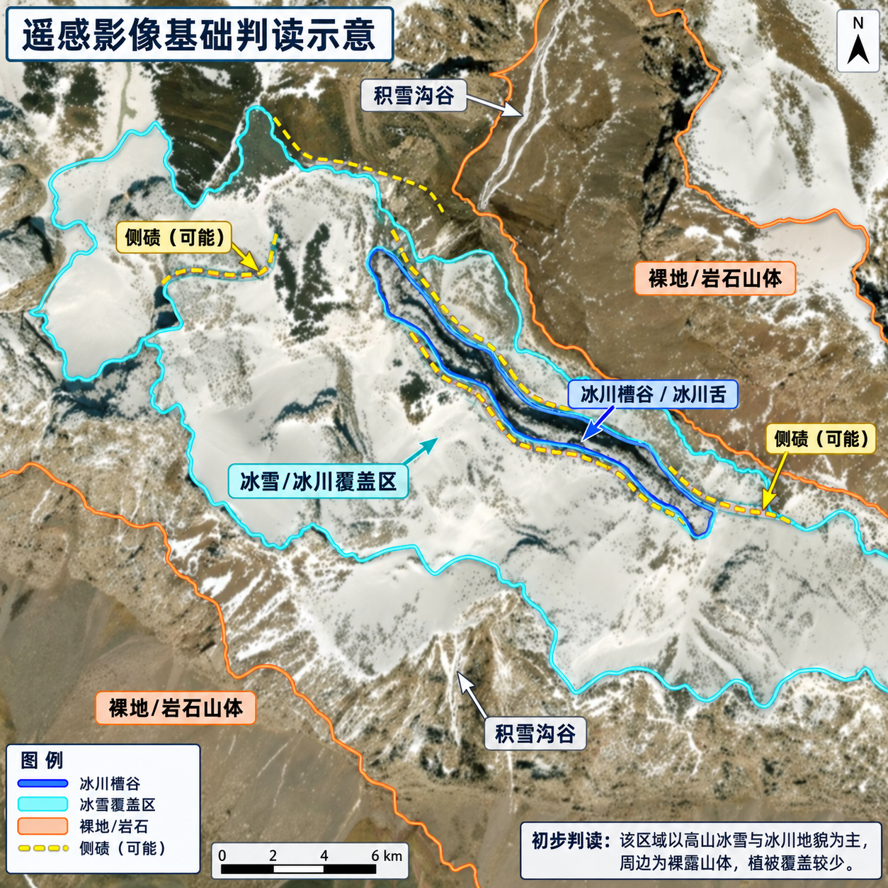
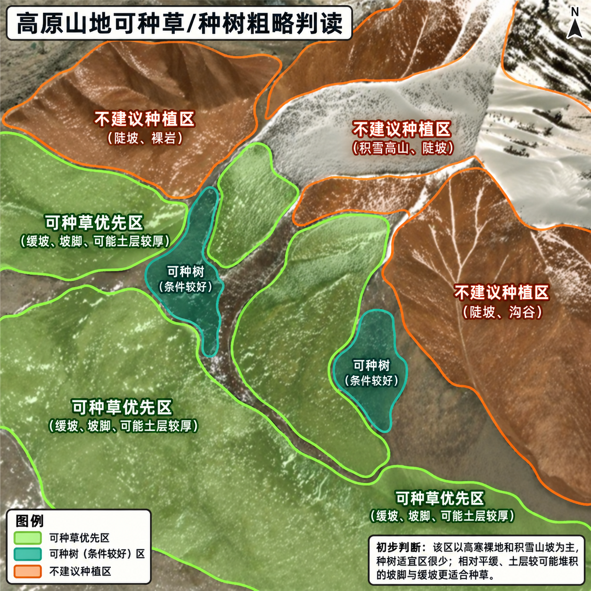

# 🗺️ 新疆维吾尔自治区标注项目进度 (26.9.12.XinJiang)

> [!NOTE]
> 本仓库仅同步 Labelme 标注所生成的 JSON 数据。图片总数在 `config.json` 中配置，GitHub Actions 会在每次推送时自动统计当前的 JSON 文件数量并更新此看板。

## 🛰️ GPT 辅助判读示意

> [!TIP]
> 下列图片由 GPT 根据遥感影像生成，用于统一高原山地的判读思路。图中的边界和文字均为辅助解释，不是最终标注真值；实际圈画仍应以原始高分辨率影像和项目标准为准。

  

**基础地物判读：** 青色范围表示连续冰雪／冰川覆盖区，可作为 **7 冰雪** 的边界参考；橙色范围表示裸地或岩石山体，通常优先考虑 **11 不可种植区**；蓝色线强调冰川槽谷／冰川舌的形态。黄色虚线标出的“侧碛（可能）”是辅助识别冰川地貌的线索，本身不是独立标签，不能仅凭该线索直接定类。

  

**种植适宜性初判：** 绿色范围表示相对平缓、可能具有一定土层的 **可种草优先区**，可作为 **8 裸地种草区** 的候选；深青色小范围表示条件较好的 **可种树候选区**，对应 **9 裸地种树区**；橙色陡坡、沟谷、裸岩和积雪高山属于 **不建议种植区**，通常对应 **11 不可种植区**。

- 图中的颜色只表达本示意图的判读分区，不应套用为整个项目的固定显示颜色。
- **8、9、10 类属于适宜性判断**，仅凭一张自然色影像无法可靠定论；还应结合坡度、水源、土层厚度、盐碱度、已有植被和现场资料。
- 对边界模糊、阴影遮挡或无法确认的区域应保守圈画，避免为了填满画面而强行赋予标签。

---

### 📊 标注状态看板

| 统计项 | 数值 | 占比 / 进度条 |
| :--- | :---: | :--- |
| **总图片数 (Total)** | **408** | `[████████████████████]` 100.0% |
| **已标记 (Completed)** | **9** | `[░░░░░░░░░░░░░░░░░░░░]` 2.2% |
| **未标记 (Remaining)** | **399** | `[░░░░░░░░░░░░░░░░░░░░]` 97.8% |

**当前总体进度：**
-blue?style=for-the-badge&logo=github)

### 📈 标注进度趋势折线图

---
### 📅 每日标注聚合日志

<b>2026-09-12</b> : 进度 9/408 (2.2%) | 🌟 新增 9 | 🔨 加强 0 🔽

 
  

  
🌟 <b>新增文件 (9)</b> 🔽

  `XinJiang-阿合奇县-11-29`, `XinJiang-阿合奇县-11-8`, `XinJiang-阿合奇县-11-9`, `XinJiang-阿合奇县-13-29`, `XinJiang-阿合奇县-13-33`, `XinJiang-阿合奇县-13-34`, `XinJiang-阿合奇县-13-46`, `XinJiang-阿合奇县-14-44`, `XinJiang-阿合奇县-9-16`
  

---
*📅 统计更新时间：2026-09-12 20:56:32 (UTC+8)*

---
## 👥 多人协作说明
本项目已全面接入 **GitHub Actions**。作为协作者，您**无需**在本地运行任何脚本或配置任何 Git 钩子。
只要您正常将 `.json` 文件 `git push` 到仓库，云端就会自动计算并更新此 README 文件和趋势图！
（如果您向本地库新增了待标注图片，请顺手修改 `config.json` 中的 `total_images` 数值即可。）
