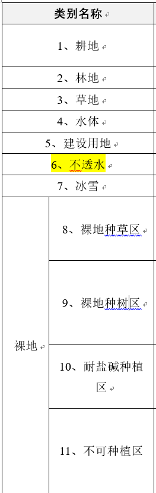
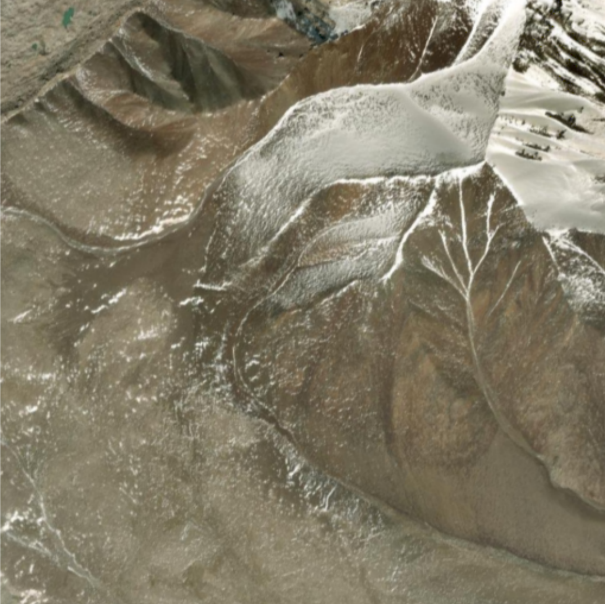
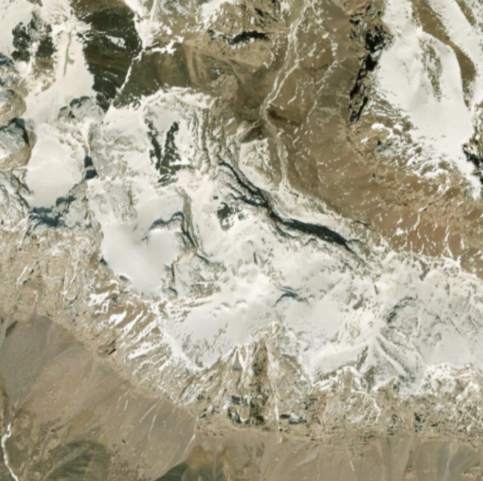
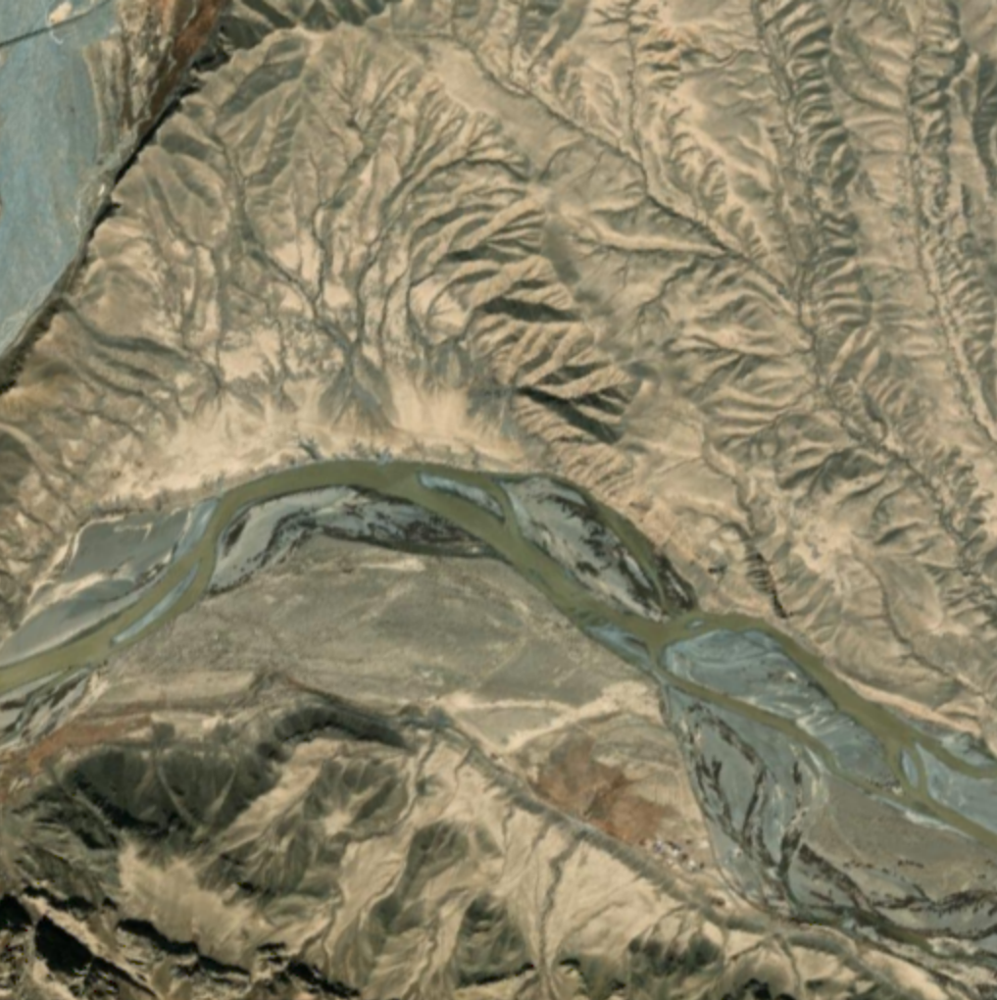

# 🗺️ 新疆维吾尔自治区标注项目进度 (26.9.12.XinJiang)

> [!NOTE]
> 本仓库仅同步 Labelme 标注所生成的 JSON 数据。图片总数在 `config.json` 中配置，GitHub Actions 会在每次推送时自动统计当前的 JSON 文件数量并更新此看板。

### 📊 标注状态看板

| 统计项 | 数值 | 占比 / 进度条 |
| :--- | :---: | :--- |
| **总图片数 (Total)** | **408** | `[████████████████████]` 100.0% |
| **已标记 (Completed)** | **9** | `[░░░░░░░░░░░░░░░░░░░░]` 2.2% |
| **未标记 (Remaining)** | **399** | `[░░░░░░░░░░░░░░░░░░░░]` 97.8% |

**当前总体进度：**
-blue?style=for-the-badge&logo=github)

### 📈 标注进度趋势折线图

---
## 🧭 标签判读参考

> [!TIP]
> 下列影像用于统一判读思路，不是可直接套用的标注真值。实际圈画时应查看原始分辨率影像，并结合地形、纹理、形状及周边环境综合判断。

### 11 类标签速查

  

- **1—7 类**主要描述可直接观察的地表覆盖：耕地、林地、草地、水体、建设用地、不透水面和冰雪。
- **8—11 类**用于裸地的种植适宜性细分。仅凭单张自然色影像通常无法可靠区分种草、种树或耐盐碱种植区，应结合坡度、水源、土壤盐碱度、已有植被和现场资料。
- **建设用地与不透水面容易混淆**：道路、屋顶和硬化场地通常具有规则的人工几何边界；天然砂砾滩、裸岩和冲积物即使呈灰白色，也不应因此标成不透水面。

### 典型场景示例

| 积雪山地 | 冰雪—裸岩混合区 | 高山河谷与冲积滩 |
| :---: | :---: | :---: |
|  |  |  |
| 连续亮白、表面较平滑的区域优先考虑 **7 冰雪**；褐灰色陡坡和裸岩多归入 **11 不可种植区**。零散暗绿斑块需放大确认后再判断草地或林地。 | 冰雪与裸岩交错时，重点看连续性与纹理：冰雪通常明亮且连片，裸岩纹理更粗糙、起伏更明显。山体阴影不能仅因颜色较深就判成水体。 | 连续分汊的绿灰色带状区域可判为 **4 水体**；宽阔砂砾滩和天然冲积物通常属于裸地或 **11 不可种植区**，不应误判为 **6 不透水**。 |

> **种植适宜性提示：** 对“8 裸地种草区、9 裸地种树区、10 耐盐碱种植区”的判断，遥感影像只适合做初步筛选，最终分类应以项目统一标准和辅助资料为准。

---
### 📅 每日标注聚合日志

<b>2026-09-12</b> : 进度 9/408 (2.2%) | 🌟 新增 9 | 🔨 加强 0 🔽

 
  

  
🌟 <b>新增文件 (9)</b> 🔽

  `XinJiang-阿合奇县-11-29`, `XinJiang-阿合奇县-11-8`, `XinJiang-阿合奇县-11-9`, `XinJiang-阿合奇县-13-29`, `XinJiang-阿合奇县-13-33`, `XinJiang-阿合奇县-13-34`, `XinJiang-阿合奇县-13-46`, `XinJiang-阿合奇县-14-44`, `XinJiang-阿合奇县-9-16`
  

---
*📅 统计更新时间：2026-09-12 20:47:02 (UTC+8)*

---
## 👥 多人协作说明
本项目已全面接入 **GitHub Actions**。作为协作者，您**无需**在本地运行任何脚本或配置任何 Git 钩子。
只要您正常将 `.json` 文件 `git push` 到仓库，云端就会自动计算并更新此 README 文件和趋势图！
（如果您向本地库新增了待标注图片，请顺手修改 `config.json` 中的 `total_images` 数值即可。）
